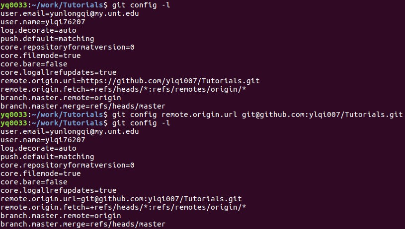

[TOC]

#### 1. [src refspec master does not match any error when pushing to repository](https://confluence.atlassian.com/bitbucketserverkb/src-refspec-master-does-not-match-any-error-when-pushing-to-repository-788727186.html)

#### 2. [How do I ensure Git doesn't ask me for my GitHub username and password?](https://superuser.com/questions/199507/how-do-i-ensure-git-doesnt-ask-me-for-my-github-username-and-password) 
因为使用了不同的协议。 


如 `git config remote.origin.url <...>` 前后的 `remote.origin.url` 所示。

#### 3. [Untrack files already added to git repository based on .gitignore](http://www.codeblocq.com/2016/01/Untrack-files-already-added-to-git-repository-based-on-gitignore/)

如果不小心 track 了一些文件或目录，想要将其从**暂存区**移除，但是依然在本地保留，则可以考虑下面命令：
```bash
git rm -r --cached .
```
* `rm` is the remove command
* `-r` will allow recursive removal
* `--cached` will only remove files from index, but the files will still be there
* `.` indicates that all files will be untracked. You want to untrack a specific file with `git rm --cached <file>`.

#### 4. [Untrack files]()
Use the following command to unstage files:

```bash 
git reset HEAD <file>...
```

#### 5. [There is no tracking information for the current branch](https://stackoverflow.com/questions/32056324/there-is-no-tracking-information-for-the-current-branch)
[git branch --set-upstream 本地关联远程分支](https://blog.csdn.net/z1137730824/article/details/78254564)

#### 6. Errors of `git pull fatal`: 

* `refusing to merge unrelated histories` and `fatal: Couldn't find remote ref master`

* [The “fatal: refusing to merge unrelated histories” Git error](https://www.educative.io/edpresso/the-fatal-refusing-to-merge-unrelated-histories-git-error)

#### 7. error: Your local changes to the following files would be overwritten by merge

当 remote 超前 local，且 local 作出了一些修改的时候，`git pull` 的时候会报错，这时候可以先将 local 的修改保存在 stack 中，然后 `git pull` 将 remote 的 pull 到 local，最后再将 stack 中的修改 pop 出来。

* [How do I ignore an error on 'git pull' about my local changes would be overwritten by merge?](https://stackoverflow.com/questions/14318234/how-do-i-ignore-an-error-on-git-pull-about-my-local-changes-would-be-overwritt)
* [How do I resolve git saying “Commit your changes or stash them before you can merge”?](https://stackoverflow.com/questions/15745045/how-do-i-resolve-git-saying-commit-your-changes-or-stash-them-before-you-can-me)
    1. Option 1: **Commit the change using:** `git commit -m "commit info"`
    2. Option 2: **Stash it:** Stashing acts as a stack, where you can push changes, and you pop them in reverse order.
        * `git stash` -> merge --> `git stash pop`.
        * You can use `git stash -u` to stash uncommitted files too.
    3. Option 3: **Discard the local changes:**
        * Using `git reset --hard` or `git checkout -t -f remote/branch`
        * Discard local changes for a specific file: `git checkout filename`

* [Git冲突：commit your changes or stash them before you can merge.](https://blog.csdn.net/lincyang/article/details/21519333)
* [【Git学习笔记】Git冲突：commit your changes or stash them before you can merge.](https://blog.csdn.net/liuchunming033/article/details/45368237)
* [How to remove a directory from git repository?](https://stackoverflow.com/questions/6313126/how-to-remove-a-directory-from-git-repository)

#### 8. Rename Repository
起因：我想把原有的 `Tutorials/` 改为 `notebooks/`，但是 `Tutorials/` 是一个 Git reposioty，与 Github 中 的 `Tutorials/` 相关连。
起初觉得不能简单改变名字，事后发现只需要两步就好：
1. Rename local repository: `mv Tutorials/ noteboots/`
2. Rename remote repository: Change the repository name in `Settings` of this repository.

问题：查看 remote 信息的时候，发现结果如下：
```bash
ylqi007:notebooks$ git remote -v
origin  git@github.com:ylqi007/Tutorials.git (fetch)
origin  git@github.com:ylqi007/Tutorials.git (push)
```

解决：修改本地仓库信息
```bash
ylqi007:notebooks$ git remote -v
origin  git@github.com:ylqi007/Tutorials.git (fetch)
origin  git@github.com:ylqi007/Tutorials.git (push)
ylqi007:notebooks$ git remote set-url origin git@github.com:ylqi007/notebooks.git
ylqi007:notebooks$ git remote -v
origin  git@github.com:ylqi007/notebooks.git (fetch)
origin  git@github.com:ylqi007/notebooks.git (push)
```

**总结：**
1. 修改本地仓库的名称：
    `mv Tutorials notebooks`
2. 修改远程仓库名称：
    在 GitHub 仓库的 settings 中修改仓库名称。
    其实此时本地仓库依然可以进行 `git pull` and `git push`，但是 `git remote -v` 中的信息没有发生改变。
3. 修改本地仓库的远程信息：
    ```
    cd notebooks/
    git remote set-url origin git@github.com:ylqi007/notebooks.git
    git remote -v
    ```
    此时 `git remote -v` 就可以看到远程仓库的名称已经改变了。


* [Github:重命名仓库](https://gohom.win/2015/12/17/git-rename-repo/)
* [git修改本地和远程仓库名称的解决方法](https://www.cnblogs.com/zlting/p/9620259.html)


