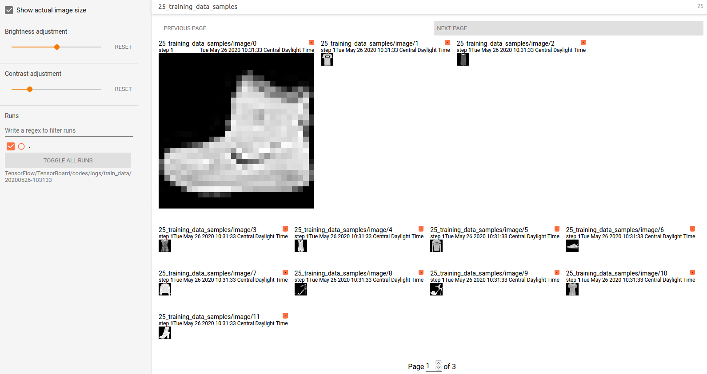

# [Displaying image data in TensorBoard](https://www.tensorflow.org/tensorboard/image_summaries)

## Overview
> Using the TensorFlow Image Summary API, you can easily log tensors and arbitrary images and view them in TensorBoard. 
> This can be extremely helpful to sample and examine your input data, or to visualize layer weights and generated tensors.     
> [使用 TensorFlow Summary API 可以记录 `tensors` and `arbitrary images` 并在 TensorBoard 中查看它们。这对于输入数据的检测和层权重以及生成 `tensors` 的检测。]

## Setup

## Visualizing a single image
[demo code](codes/demo_0.py)

* `tf.summary.image()` expects a rank-4 tensor containing `(batch_size, height, width, channels)`. Therefore, the tensors need to be reshaped to have this shape.     

当要记录的 image 已经设置好合适的形状之后，就可以进行正式的记录。   
     
* Sets up a timestamped log directory and then creates a `file writer` for the log directory. `file_writer = tf.summary.FileWriter(logdir)`   
[首先要设置一个存放 event 文件的目录，然后创建一个 `FileWriter`，这个 `FileWriter` 用于将 summaries 写入相应的文件。]

* Creates the summary for the specific tensor/images.       
[这一步是为要记录的 image 创建一个 `img_summary`，这个 `summary` 现在还是一个 tensor，需要在 `eval()` 之后才能真正的生成数据，然后被 `FileWriter` 写入 log 文件中。]
```python
img_summary = tf.summary.image(name="Training data", tensor=img)
summary = sess.run(img_summary)
```

* Add to log file through `FileWriter`      
[通过 `FileWriter` 写入到 log 文件中，也就是 event 文件中。]
```python
file_writer.add_summary(summary, global_step=0)
```

> The image is scaled to a default size for easier viewing, if you want to view the unscaled original image, check `Show actual image size` at the upper left.


## Visualizing multiple images


[demo code](codes/demo_0.py)

## Logging arbitrary image data
> What if you want to visualize an image that's not a tensor, such as an image generated by `matplotlib`? You need some boilerplate code to convert the plot to a tensor, but after that, you'are good to go.       
> [此时想可视化一个 image，而不是 tensor 的话，应该如何处理。]

## Building an image classifier
[demo code, Doesn't work now](codes/demo_1.py)

Now put all together with a real example.
* First, create a very simple model and compile it, setting up the optimizer and loss function.
* Ready to train the classifier and regularly log the confusion:
    * Create the Keras TensorBoard callback to log basic metrics
    * Create a Keras LambdaCallback to log the confusion matrix at the end of every epoch
    * Train the model using Model.fit(), making sure to pass both callbacks


